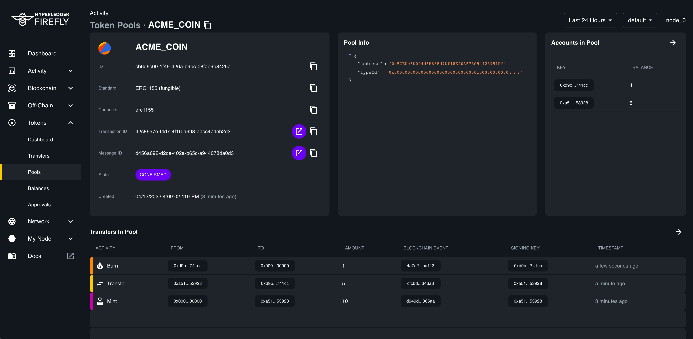

# FireFly UI


[](https://github.com/mkenney/software-guides/blob/master/STABILITY-BADGES.md#release-candidate)
[](https://hyperledger.github.io/firefly//)


This is the User Interface for FireFly. It allows yo to easily see everything that is going on in your FireFly system.

### Dashboard


### Events Timeline


### Token Pools



## Setup

To run the application, you will require a 2-party FireFly system running
locally on ports 5000 & 5001. The easiest way to set this up is with the
[FireFly CLI](https://github.com/hyperledger/firefly-cli):

```
ff init myFireFly 2
ff start myFireFly
```

## Running

Once the FireFly stack is ready, you can view it a http://localhost:5000/ui

## Getting started locally

To start developing the UI locally, make sure to have a 2-party FireFly system running locally.

```bash
git clone https://github.com/hyperledger/firefly-ui
cd firefly-ui
npm i
npm run start
```

## Learn more about Hyperledger FireFly Architecture

- [YouTube Channel](https://www.youtube.com/playlist?list=PL0MZ85B_96CFVEdBNsHRoX_f15AJacZJD)
  - Check out the architecture series
- [Architecture reference documentation](https://hyperledger.github.io/firefly/architecture/node_component_architecture.html)
  - Join the discussion [on Discord](http://discord.gg/hyperledger)

## Git repositories

There are multiple Git repos making up the Hyperledger FireFly project, and this
list is likely to grow as additional pluggable extensions come online in the community:

- Command Line Interface (CLI) - https://github.com/hyperledger/firefly-cli
- Core - https://github.com/hyperledger/firefly
- FireFly SDK - https://github.com/kaleido-io/firefly-sdk-nodejs
- FireFly UI (this repo) - https://github.com/hyperledger/firefly-ui
- HTTPS Data Exchange - https://github.com/hyperledger/firefly-dataexchange-https
- Hyperledger Fabric connector - https://github.com/hyperledger/firefly-fabconnect
- Ethereum (Hyperledger Besu / Quorum) connector - https://github.com/hyperledger/firefly-ethconnect
- Corda connector: https://github.com/hyperledger/firefly-cordaconnect - contributed from Kaleido generation 1 - porting to generation 2
- FireFly Sandbox - https://github.com/hyperledger/firefly-sandbox
- Firefly Performance CLI (https://github.com/hyperledger/firefly-perf-cli)

## Contributing

Interested in contributing to the community?

Check out our [Contributor Guide](https://hyperledger.github.io/firefly/contributors/contributors.html), and welcome!

Please adhere to this project's [Code of Conduct](CODE_OF_CONDUCT.md).

## License

Hyperledger Project source code files are made available under the Apache License, Version 2.0 (Apache-2.0), located in the [LICENSE](LICENSE) file.
