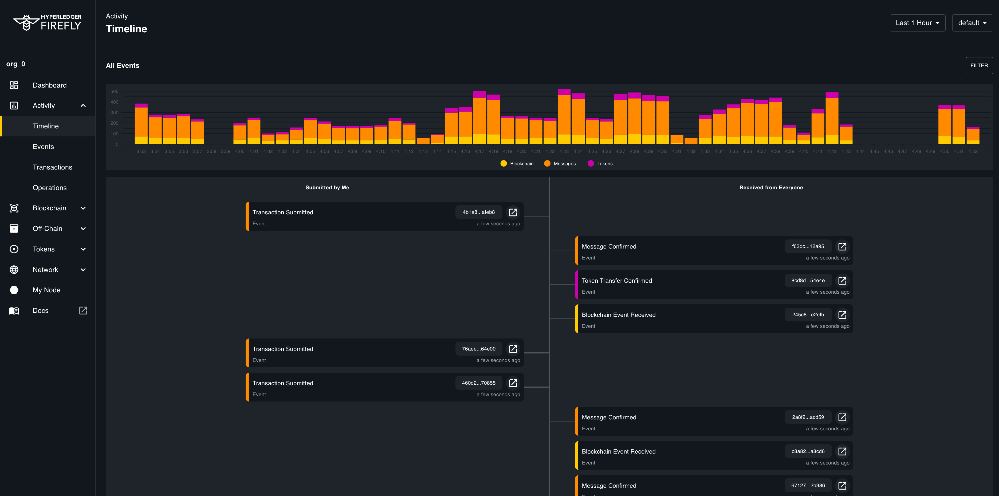

# FireFly UI

firefly-ui is the UI explorer for [FireFly](https://github.com/hyperledger/firefly)

### Get started locally

- Clone / start firefly-ui

```bash
git clone https://github.com/kaleido-io/firefly-ui
cd firefly-ui
npm i
npm run start
```

### Dashboard


### Events Timeline


